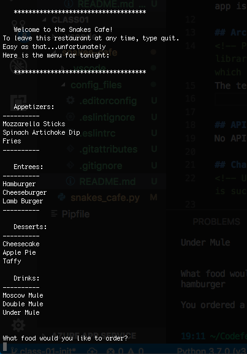

# Lab 01: Intro to Python

**Author**: Stephen Harper
**Version**: 1.0.1
**Github**: https://github.com/indigoshock

## Overview
This is a terminal app which poses as a virtual restaurant called Snakes cafe.

## Getting Started
The steps a user must take to get this app up and running on their machine is to download VS Code. Download the Python extension. And download Git Bash or Terminal. One way to run this app is to clone this repo on github.

## Architecture
The technologies used are the python language. VS Code.

## API
No API's were harmed in the making of this.

## Change Log
08-13-2018 7:16pm - Functionality. README with visual and config files added.
08-14-2018 10:41pm - Functionality broken. Refactored. Added test_plan.md.
